# Settings Database Editor

| **Requested by:** | **AURA**     |
| ----------------- | ------------ |
| **Doc. Code**     |              |
| **Editor:**       | Julen Garcia |
| **Approved by:**  | -            |

## Index

- [Settings Database Editor](#settings-database-editor)
  - [Index](#index)
  - [Introduction](#introduction)
  - [Application location and launch](#application-location-and-launch)
  - [Application usage](#application-usage)
    - [Settings tab](#settings-tab)
      - [Modifying existing setting](#modifying-existing-setting)
      - [Create new setting](#create-new-setting)
      - [Remove existing setting](#remove-existing-setting)
    - [Events](#events)
      - [Modifying existing event](#modifying-existing-event)
      - [Create new event](#create-new-event)
      - [Remove existing event](#remove-existing-event)
    - [Statecharts](#statecharts)
      - [Modifying existing statechart](#modifying-existing-statechart)
      - [Create new statechart](#create-new-statechart)
      - [Remove existing statechart](#remove-existing-statechart)
    - [Instances](#instances)
      - [Modifying existing instance](#modifying-existing-instance)
      - [Create new instance](#create-new-instance)
      - [Remove existing instance](#remove-existing-instance)

## Introduction

This document contains the documentation for the `SettingsDatabaseEditor` application. This application can be used to
modify, create or remove settings in the database, as well as events, therefore, this application can be used only by
maintenance level users.

## Application location and launch

The application is installed in the MCC, the server that runs both the EUI and the database itself. This application can
be found at `/usr/local/TMA_SettingsDatabaseEditor` and is called ***SettingsDatabaseEditor***.

Once the application is launched the first window looks like the following image, just wait until the user is requested.

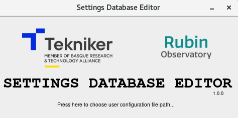

> Only if the application fails for not finding the users definition file, press the button that says:
> `Press here to choose user configuration file path...`

If everything goes as expected, a user and password are requested, see image below. To manage the database the logged in
user must be a user with M_Maintenance privileges.

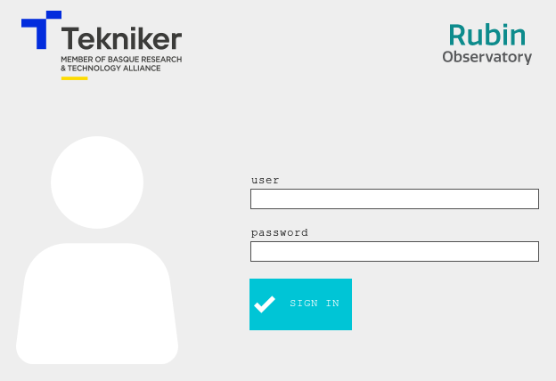

> If the provided user is not a M_Maintenance user the application will return an error pop-up.

Once the user is entered correctly the settings and events management window is displayed, see image below.

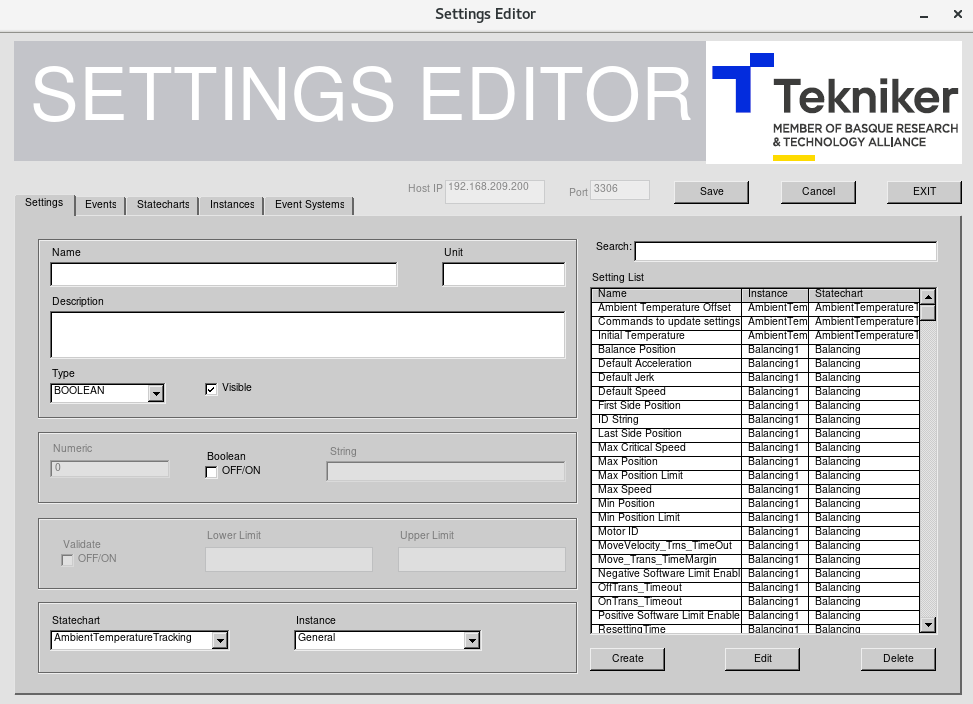

## Application usage

The application has 5 tabs, this means 5 different sections for different actions, these actions are explained in
independent sections below.

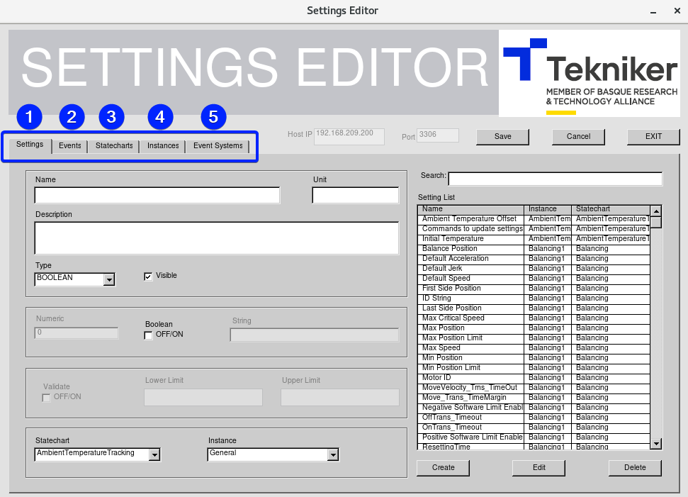

### Settings tab

This is the default tab and is launched first by default, here settings can be modified, created or removed.

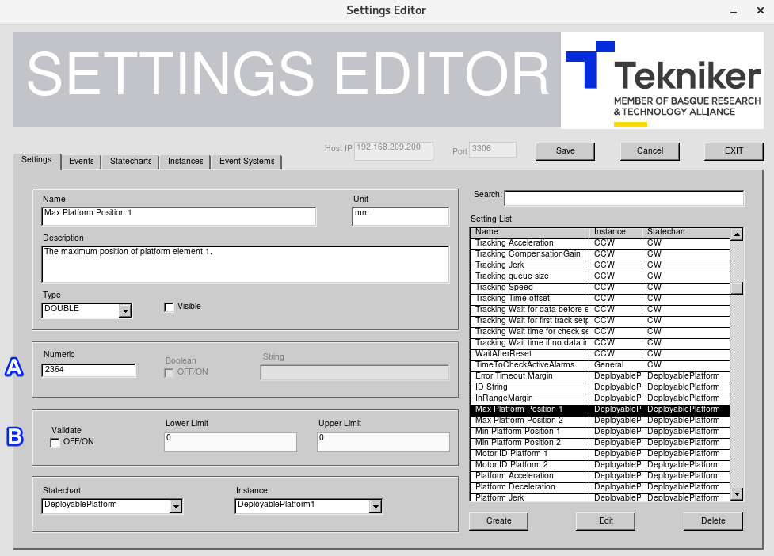

#### Modifying existing setting

- Select the desired setting from the `Setting list` on the right, this will load the related information on the left:
  - Name: this is the setting name.
  - Unit: for specifying units, when needed.
  - Description: this is displayed in the EUI to help the users understand the settings purpose.
  - Visible: this is a true/false switch, for making these restricted or not.
    - Visible = true -> this setting is visible to all users.
    - Visible = false -> this setting is visible to high privilege users only, M_Maintenance users.
  - Type: this is an enum with three options, depending on the selected type, the controls below, in sections A and B fom
    the image above, will change accordingly.
    - Double: for double float settings.
      - Numeric: this is the value of the setting, this updates the saved value of the setting.
      - Validate: this is a true/false switch, when on the value entered in the EUI for the setting must be in between
        the provided range by *Lower Limit* and *Upper Limit*.
    - Boolean: for true/false settings
      - Boolean: this is a true/false switch for the setting value, this updates the saved value of the setting.
    - String: for string settings
      - String: this is a string control for the setting value, this updates the saved value of the setting.
  - Statechart: this is an enum defined in the *Statecharts* tab and related to the code in the PXIs, as each statechart
    is a different code module in the PXI code.
  - Instance: this is an enum defined in the *Instances* tab and related to the code in the PXIs, each instance is an
    instance of the related statechart code module.
- Once the left part is updated to the desired values press the *Edit* button on the right.

  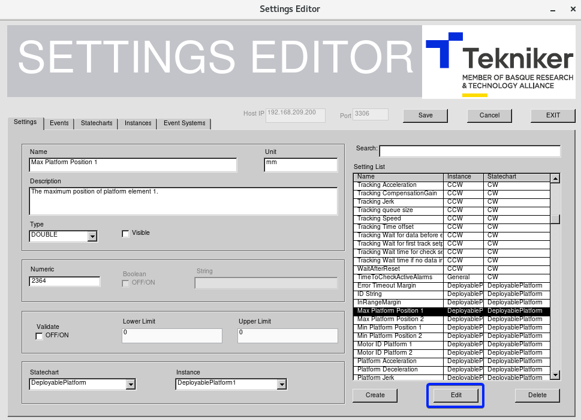

- If more than one setting is going to be modified, repeat the first two steps.
- When all the settings are modified press the *Save* button, top right of the application.

  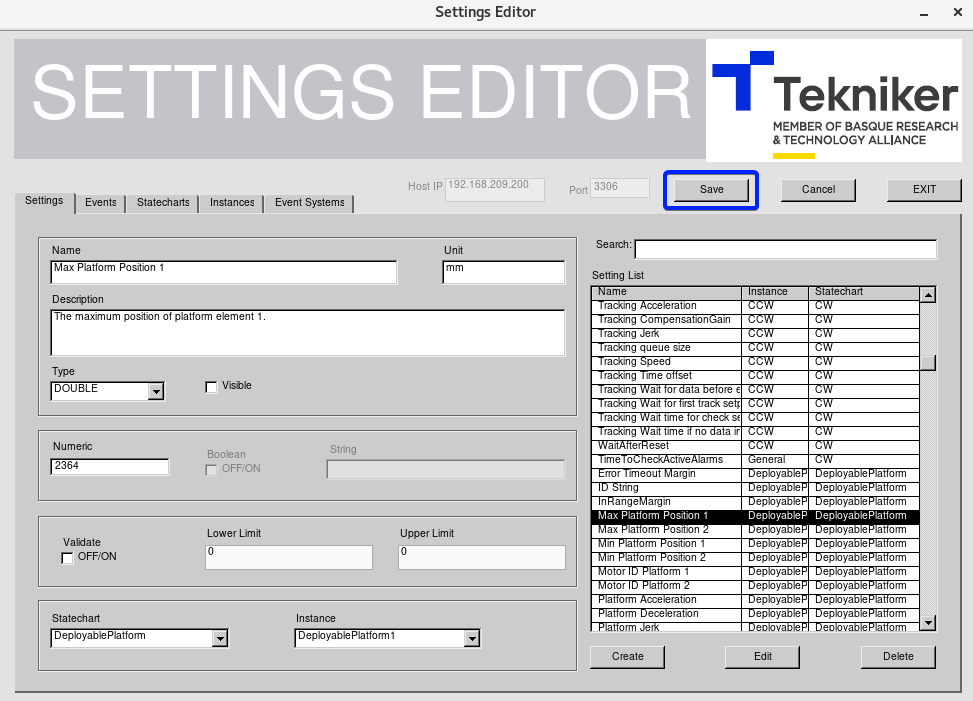

#### Create new setting

- Fill all the fields needed from the left
- Once the left part is updated to the desired values press the *Create* button on the right.

  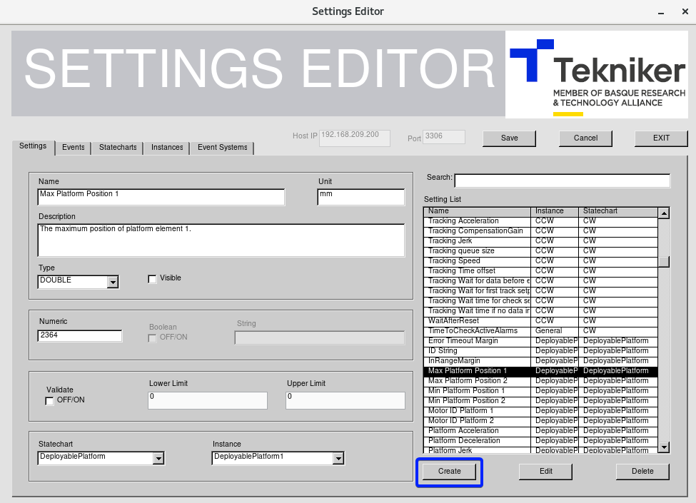

- This will create the new setting
- If more than one setting is going to be created, repeat the first two steps.
- When all the settings are created press the *Save* button, top right of the application.

  

#### Remove existing setting

- Select the desired setting from the `Setting list` on the right.
- Press the *Delete* button on the right.

  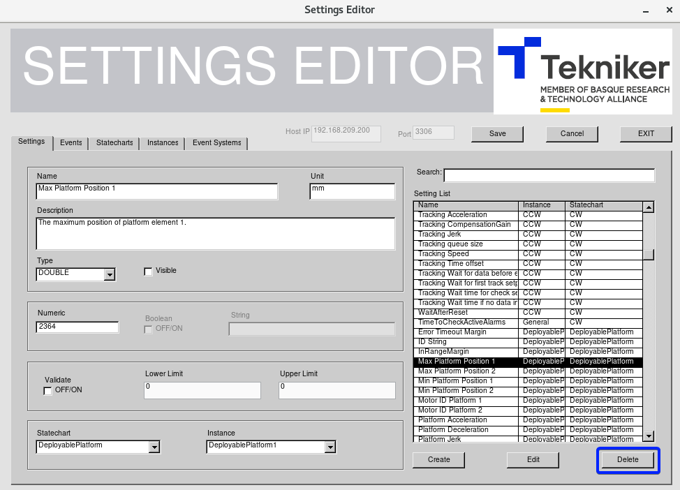

- If more than one setting is going to be removed, repeat the first two steps.
- When all the settings are modified press the *Save* button, top right of the application.

  

### Events

Here the events managed by the event system can be modified, created or removed.

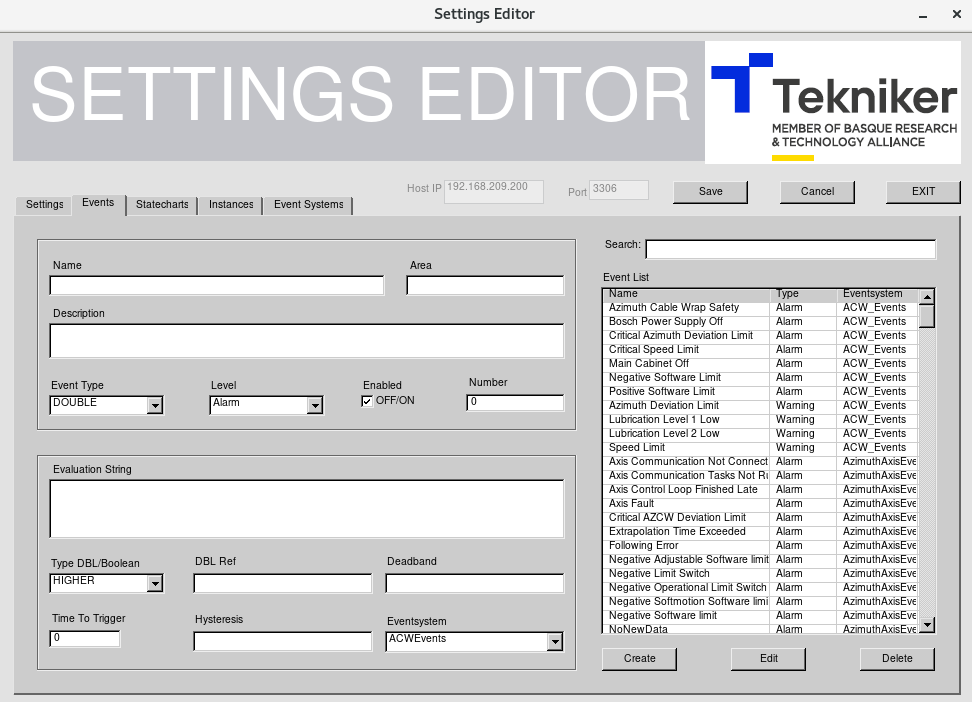

#### Modifying existing event

- Select the desired event from the `Event list` on the right, this will load the related information on the left:
  - Name: this is the event name.
  - Area: this is for tracing the event, it must contain a number from the same series of the commands, then dot (.) and
    then the abbreviation for the subsystem.
  - Description: this is the explanation of the event that will be displayed in the EUI when tripped.
  - Type Event: this is an enum with two options, this updates the section below according to the selected type.
    - Boolean: for evaluation strings that result in a boolean true/false outcome.
      - Evaluation String: this is the evaluation string, that admits names from the related settings for the subsystem,
        when setting names are detected are painted red, and names that are provided in the code when sending the data
        to the event system are black.
      - Type DBL/Boolean: this is the type of checking done with the outcome of the evaluation string and compared to the
        BOOL Ref value. This is an enum with three values: EQUAL, CROSSING FROM, CROSSING TO.
      - BOOL Ref: this is the value that is compared to the outcome of the evaluation string depending on the type.
    - Double: for evaluation strings that result in a double numeric outcome.
      - Evaluation String: this is the evaluation string, that admits names from the related settings for the subsystem,
        when setting names are detected are painted red, and names that are provided in the code when sending the data
        to the event system are black.
      - Type DBL/Boolean: this is the type of checking done with the outcome of the evaluation string and compared to the
        DBL Ref value. This is an enum with four values: HIGHER, LOWER, EQUAL, NOT EQUAL.
      - DBL Ref: this is the value that is compared to the outcome of the evaluation string depending on the type.
      - Deadband: this is the deadband to avoid flickering with values that are close to the reference value.
      - Hysteresis: this is the hysteresis for the comparison.
  - Eventsystem: this is an enum defined in the *Event Systems* tab and related to the code in the PXIs, as each eventsystem
    is related to a different code module in the PXI code.
- Once the left part is updated to the desired values press the *Edit* button on the right.

  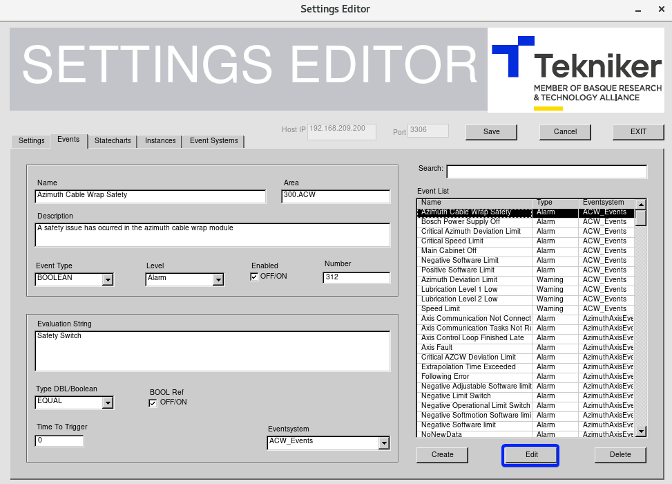

- If more than one event is going to be modified, repeat the first two steps.
- When all the events are modified press the *Save* button, top right of the application.

  

#### Create new event

- Fill all the fields needed from the left
- Once the left part is updated to the desired values press the *Create* button on the right.

  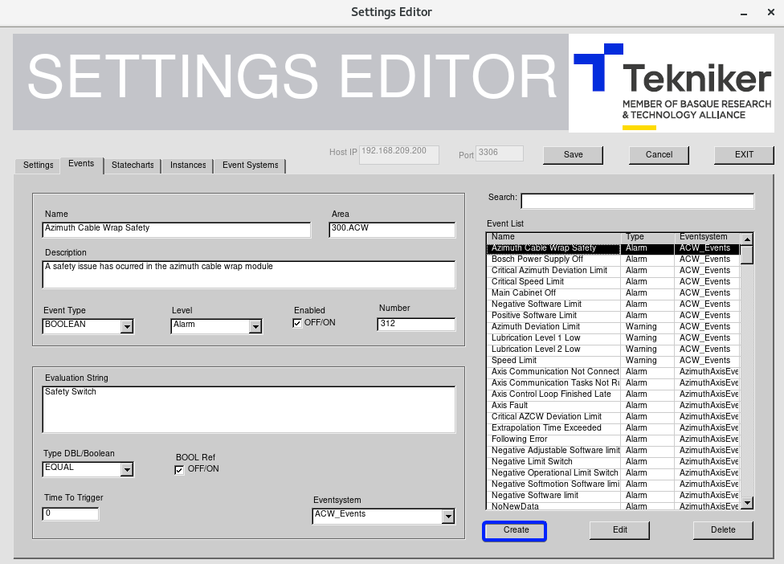

- This will create the new event
- If more than one event is going to be created, repeat the first two steps.
- When all the events are created press the *Save* button, top right of the application.

  

#### Remove existing event

- Select the desired event from the `Event list` on the right.
- Press the *Delete* button on the right.

  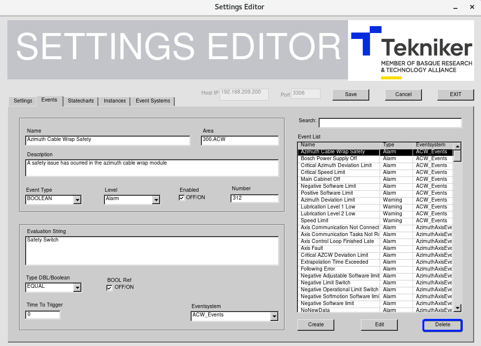

- If more than one event is going to be removed, repeat the first two steps.
- When all the events are modified press the *Save* button, top right of the application.

  

### Statecharts

Here the statecharts that are going to be available for the settings are managed, created, modified and deleted.

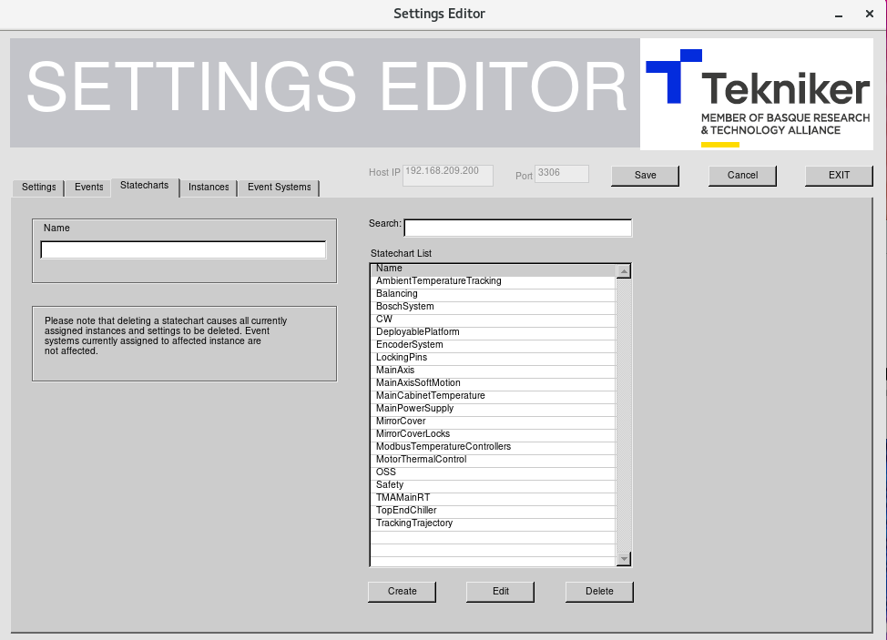

#### Modifying existing statechart

- Select the desired statechart from the `Statechart list` on the right, this will load the related information on the left:
  - Name: this is the statechart name.
- Once the left part is updated, the name is changed, press the *Edit* button on the right.

  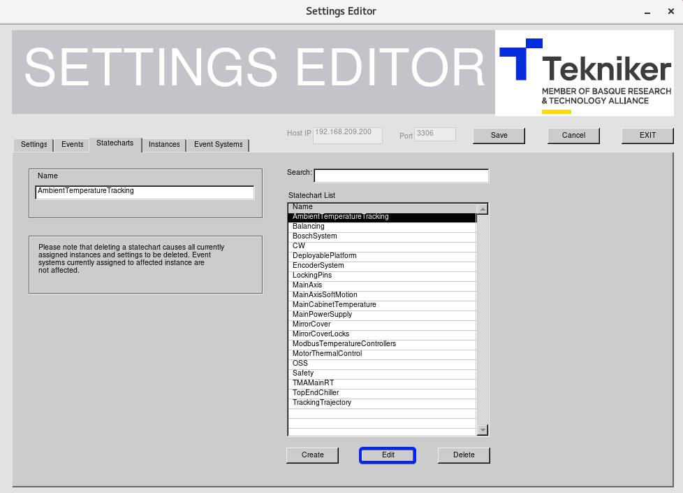

- If more than one statechart is going to be modified, repeat the first two steps.
- When all the statecharts are modified press the *Save* button, top right of the application.

  

#### Create new statechart

- Add the name for the statechart.
- Press the *Create* button on the right.

  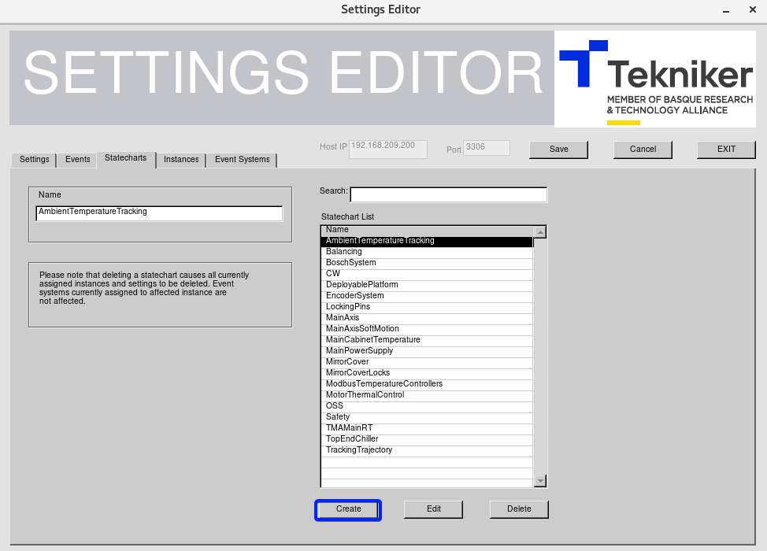

- This will create the new statechart.
- If more than one statechart is going to be created, repeat the first two steps.
- When all the statecharts are created press the *Save* button, top right of the application.

  

#### Remove existing statechart

> Note that deleting a statechart causes all currently assigned instances and settings to be deleted. Event systems
> assigned to the related instances are not affected.

- Select the desired statechart from the `Statechart list` on the right.
- Press the *Delete* button on the right.

  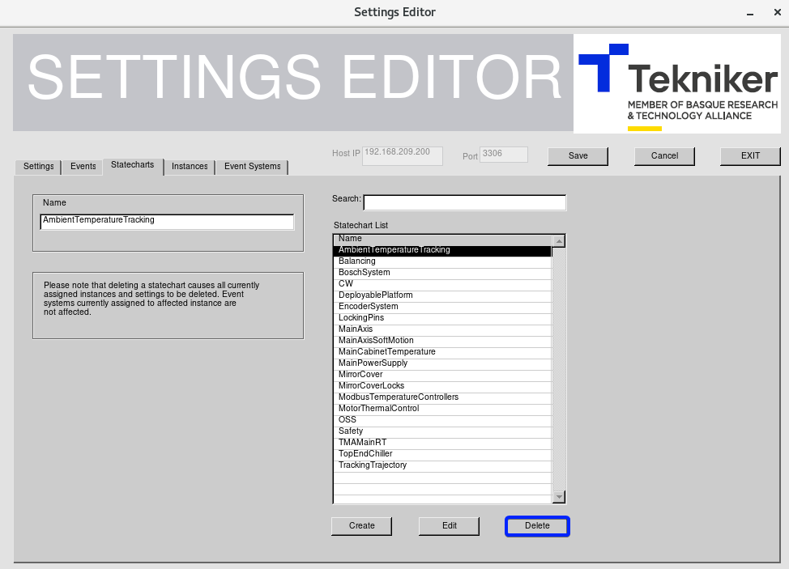

- If more than one statechart is going to be removed, repeat the first two steps.
- When all the statecharts are modified press the *Save* button, top right of the application.

  

### Instances

Here the instances that are going to be available for the settings are managed, created, modified and deleted.

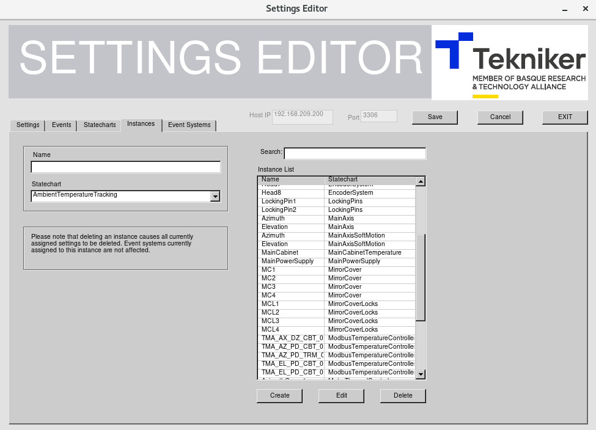

#### Modifying existing instance

- Select the desired instance from the `Instance list` on the right, this will load the related information on the left:
  - Name: this is the instance name.
  - Statechart: this is an enum defined in the *Statecharts* tab and related to the code in the PXIs, as each statechart
    is a different code module in the PXI code.
- Once the left part is updated, the name is changed, press the *Edit* button on the right.

  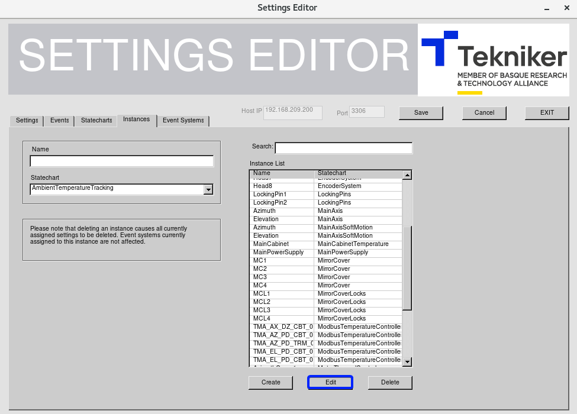

- If more than one instance is going to be modified, repeat the first two steps.
- When all the instances are modified press the *Save* button, top right of the application.

  

#### Create new instance

- Add the name for the instance.
- Select the related statechart.
- Press the *Create* button on the right.

  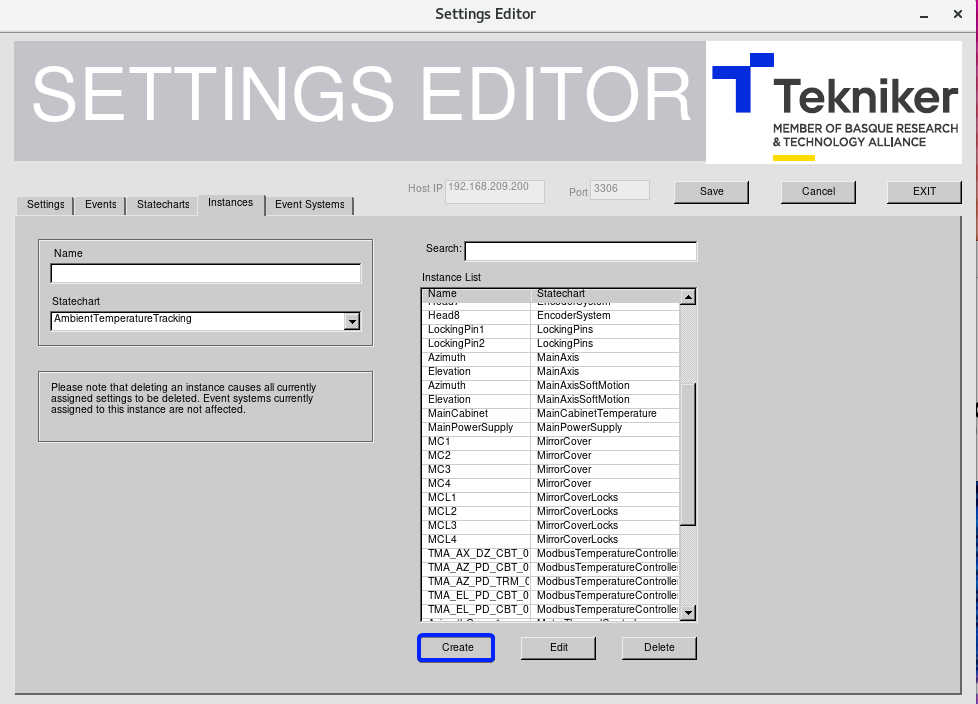

- This will create the new instance.
- If more than one instance is going to be created, repeat the first two steps.
- When all the instances are created press the *Save* button, top right of the application.

  

#### Remove existing instance

> Note that deleting an instance causes all currently assigned settings to be deleted. Event systems assigned to the
> related instances are not affected.

- Select the desired instance from the `Instance list` on the right.
- Press the *Delete* button on the right.

  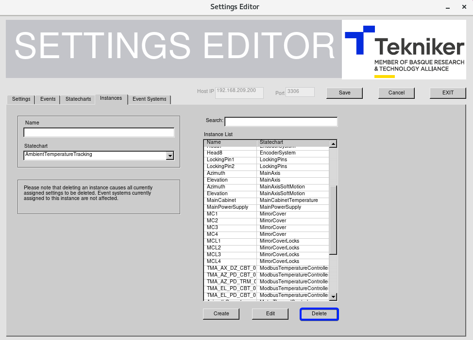

- If more than one instance is going to be removed, repeat the first two steps.
- When all the instance are modified press the *Save* button, top right of the application.

  
